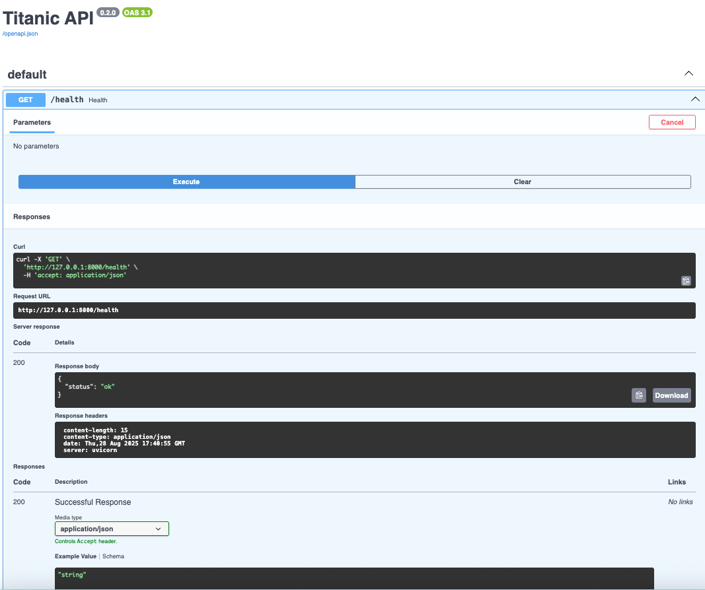
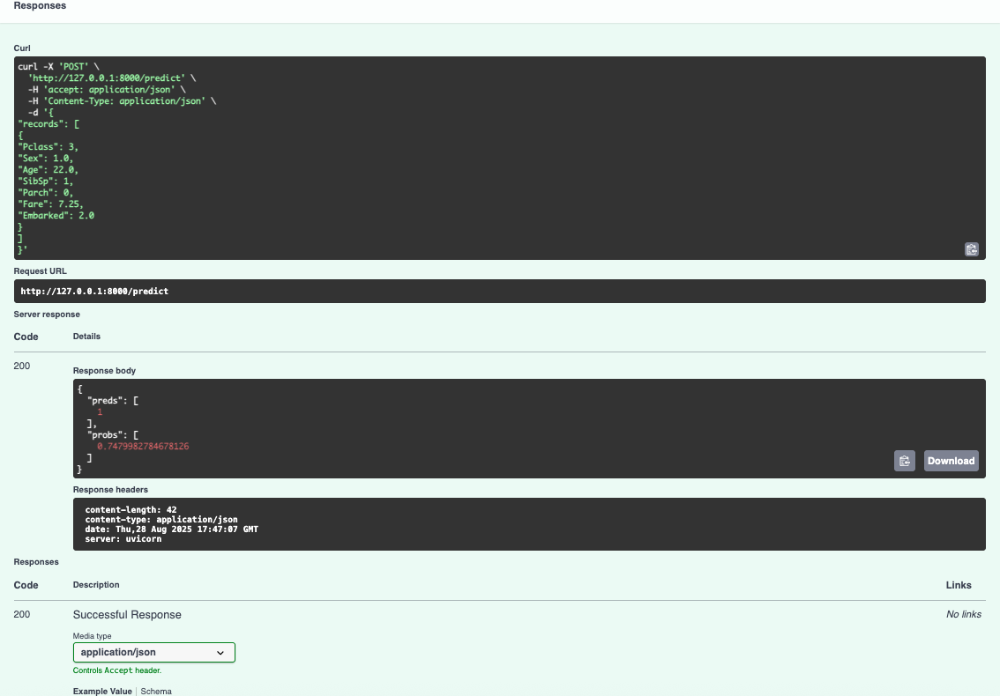
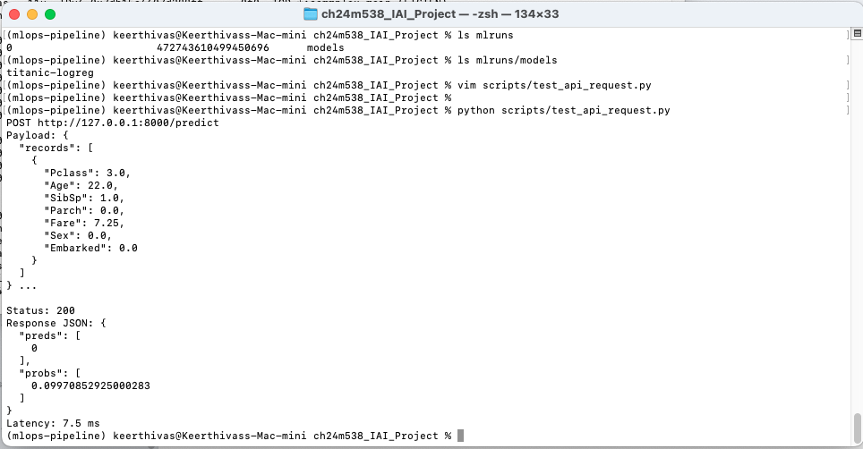
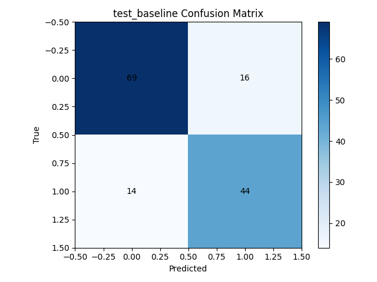
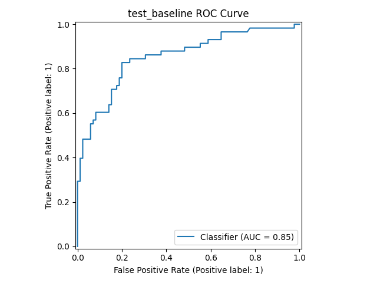
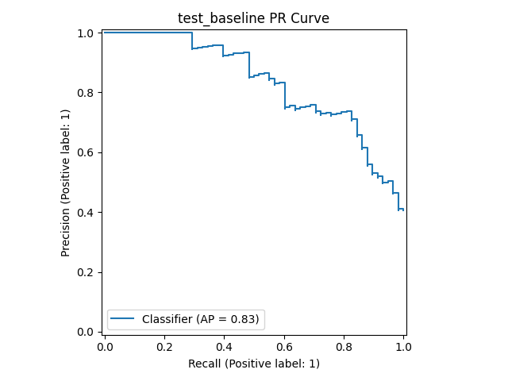
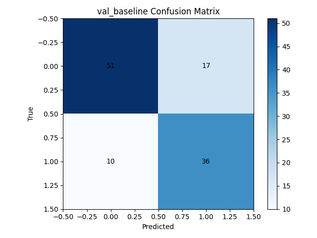
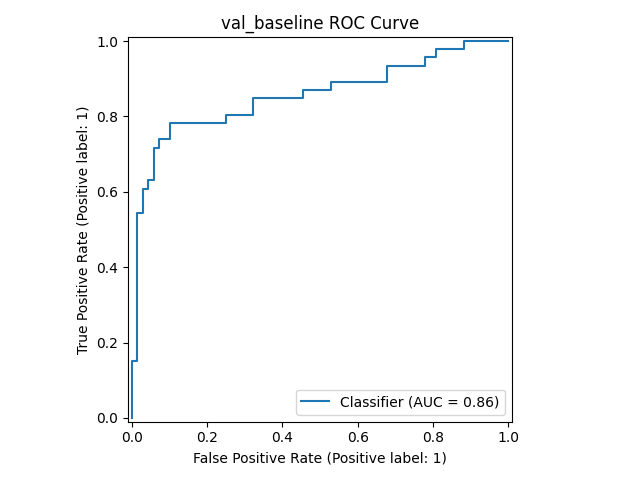
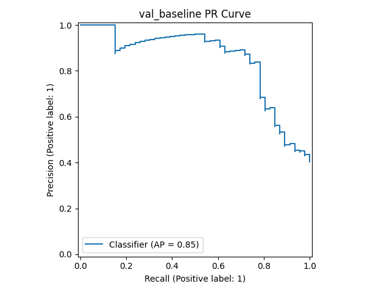

## Executive summary
This project delivers an end-to-end, reproducible MLOps pipeline for the Titanic survival classification task, integrating Spark data preprocessing, DVC pipeline orchestration, MLflow experiment tracking/registry, and a production-style FastAPI inference API that strictly enforces a saved feature contract. The promoted model is a scikit-learn Logistic Regression pipeline selected by the **f1** criterion, achieving test performance of $$ \text{accuracy} \approx 0.790 $$, $$ \text{f1} \approx 0.746 $$, and $$ \text{ROC AUC} \approx 0.854 $$, and is served deterministically from models/current.joblib with inputs aligned to reports/features.json.[3][4][5][6][7]

The pipeline is codified in DVC stages—get_data → validate_raw → preprocess → validate_features → train → promote_model—ensuring reproducibility, explicit dependencies, and audited artifacts and metrics across runs. Raw data is validated against a YAML schema for column presence, types, and domain constraints; Spark then casts types, indexes categorical columns (Sex, Embarked), drops unused string columns, and writes numeric feature Parquet files for downstream modeling. A second validation enforces numeric-only features and basic range checks, providing a safe, contract-first foundation for training and serving.[4][8][9][10]

Modeling emphasizes correctnessS and traceability: features are selected as numeric-only columns, training uses stratified splits with fixed seeds, and a StandardScaler+LogisticRegression Pipeline is logged with MLflow alongside confusion matrix, ROC, and PR plots. Optional GridSearchCV tuning can run under nested MLflow runs; both baseline and tuned artifacts are persisted so DVC stage outputs remain satisfied. The selection policy (f1) and the chosen winner are recorded into reports/metrics.json, and a promotion script copies the winner to models/current.joblib for serving.[6][11][7]

Serving is implemented via FastAPI, which loads the promoted model and the canonical ordered feature list at import time, exposes GET /health and POST /predict, and enforces exact key matching and numeric values for inputs. Requests that deviate from the feature contract return structured 400 errors; inference failures are guarded with 500 errors. This strict contract prevents training-serving skew and ensures deterministic runtime behavior; a helper script constructs a compliant payload directly from the latest features parquet for realistic end-to-end testing.[12][13][3]

Operationally, the system supports two MLflow modes: default file-store runs in ./mlruns for quick local iteration, or a local SQLite-backed MLflow server for registry demonstrations and UI browsing. The repository includes API unit tests covering health, valid prediction, and feature mismatch scenarios, plus troubleshooting guidance for common failure modes (missing artifacts, schema mismatches, absent features). These choices align with the project’s guiding principles from the attached project PDF: enforce data contracts early, maintain experiment lineage and comparability, promote models via explicit criteria, and isolate serving to a deterministic artifact path.[14][15][1]

Key outcomes
- Proven, reproducible pipeline with explicit data validation and feature-only numeric guarantees, suitable for continuous evaluation and CI/CD expansion.[10][4]
- A promoted **baseline** Logistic Regression pipeline selected by f1, achieving $$ \text{accuracy}=0.7902 $$, $$ \text{precision}=0.7333 $$, $$ \text{recall}=0.7586 $$, $$ \text{f1}=0.7458 $$, $$ \text{ROC AUC}=0.8537 $$ on test; artifacts and plots are logged to MLflow and persisted under reports/.[7][6]
- Deterministic serving via a strict feature contract and an artifact-pinned model path, reducing risk of skew, regressions, and ambiguous inputs during inference.[5][3]

## Architecture overview
This system implements a contract-first MLOps pipeline that transforms raw Titanic data into a production-grade inference service. Orchestration is managed with DVC, data integrity is enforced via YAML schema checks and numeric-only feature guards, experiment lineage and artifacts are tracked by MLflow, and serving is performed by a FastAPI app that loads a promoted model and strictly validates input features against a canonical, ordered list.[2][3][4][5][6]

### Data flow
- Ingestion: A parametrized script fetches titanic.csv into data/raw, ensuring deterministic provenance via params.yaml. Raw validation rejects schema, null, and domain violations before ETL.[7][8][9]
- Preprocessing: Spark casts types, indexes Sex and Embarked, drops non-essential strings (Name, Ticket, Cabin), validates against expectations/schemas/titanic.yaml, and writes Parquet features.[4][10]
- Feature validation: A second guard ensures numeric-only columns and basic range checks for safety before model training or serving.[5]

API boundary evidence, belongs in architecture:

*FastAPI health and predict endpoints (serving boundary)*

### Orchestration and lineage
- Pipeline: DVC stages encode get_data → validate_raw → preprocess → validate_features → train → promote_model; dvc repro materializes features/, reports/*, and models/* deterministically, capturing dependencies and outs.[3]
- Lineage: Training persists reports/features.json (authoritative input contract) and reports/metrics.json; MLflow stores metrics, plots, and model artifacts for reproducibility and audit.[11][6]

LaTeX figure (artifact paths overview kept textual here; DVC graph visual deferred to Reproducibility section to avoid duplication in architecture):
- Canonical artifacts: models/current.joblib, reports/features.json, features/*.parquet.[12][10][2]

### Model training and selection
- Training: A StandardScaler+LogisticRegression pipeline is fit on numeric-only features with stratified splits and fixed seed; optional GridSearchCV tuning runs under nested MLflow runs.[6]
- Selection and promotion: The selection metric is f1; the winner is recorded in reports/metrics.json and promoted to models/current.joblib by a dedicated step.[13][11]

LaTeX figures (evaluation plots not inserted here by design; they belong to the Model evaluation section):
- reports/plots/* (val/test confusion matrices, ROC, PR) to be placed and discussed later with metrics context.[1]

### Serving interface
- Contract-first inputs: The FastAPI app loads models/current.joblib and the exact ordered feature list from reports/features.json at import time; POST /predict requires payload keys to match this list and values to be numeric. Violations return structured 400 errors; inference exceptions return 500.[14][2][12]
- Deterministic outputs: Predictions and, when available, probabilities are returned; if predict_proba lacks a class-1 column, NaN placeholders maintain response shape.[2]

Integration request evidence for completeness, still relevant to architecture boundary:

### Tracking and registry (local mode)
- Tracking modes: File-store (./mlruns) by default; optional local server with SQLite for registry demonstrations; runs log metrics, plots, and model artifacts, with optional registration and stage transitions.[15][6]
- Evidence placement: Model registry UI screenshots will be inserted in the Experiment tracking section, not here, to keep Architecture focused on system structure.[1]
Direct answer: Proceeding with the next section per the agreed outline: Reproducibility and data lineage, with targeted figures only where they substantively aid understanding.[1]

## Reproducibility and data lineage
This section documents how the pipeline, parameters, and artifacts ensure end-to-end repeatability and auditable lineage from raw data to a promoted model ready for serving. It ties DVC stages to concrete inputs/outputs, shows parameterization points, and highlights the canonical feature contract that aligns training and inference.[2]

### DVC pipeline
- Stages and dependencies: The pipeline encodes get_data → validate_raw → preprocess → validate_features → train → promote_model with explicit deps/outs, plus reports/metrics.json and reports/plots/ tracked as no-cache to keep working copies up to date. This captures a DAG that DVC can fully reproduce via dvc repro, ensuring identical artifacts given the same inputs and params.[2]
- Artifact lineage: Key outs are data/raw/, features/ (Parquet), models/{baseline,tuned}_logreg_pipeline.joblib, models/current.joblib, reports/features.json, and reports/metrics.json; these form the chain of custody from source CSV to the served model and contract file.[2]

Recommended LaTeX block (optional DVC graph placeholder; include only if a graph image is available in docs/):
- If a static graph is exported, include it here; otherwise keep this text-only for clarity and to avoid non-essential images in this section.[3]

### Parameters and configuration
- Centralized params: The dataset URL and output paths live in params.yaml; get_data reads these to fetch and store titanic.csv deterministically, creating parent directories and failing on HTTP errors. This isolates environment-specific values and prevents hard-coded paths in scripts.[4][5]
- Tracking/registry config: A local MLflow server configuration is provided in configs/mlflow.yaml, but file-store mode works out-of-the-box; experiment name and tracking URI are set at runtime, keeping runs consistent across modes.[6]

### Deterministic features
- Spark ETL: Preprocessing casts types, indexes categorical fields, enforces the YAML schema, drops unused strings, and writes features/*.parquet. The same rules applied consistently guarantee the same column set and types across runs.[7][8]
- Numeric-only guard: A post-ETL validation step concatenates Parquet outputs and asserts that only numeric columns remain, with basic range checks to catch anomalies early. This guard blocks drift in feature types before training.[9]

### Canonical feature contract
- Feature list emission: Training writes reports/features.json with the exact ordered feature names used to fit the model; this file is logged alongside metrics for audit and is treated as the single source of truth for serving. This preserves the mapping between payload keys and model inputs across time.[10]
- Serving enforcement: The FastAPI service reads reports/features.json at import and enforces exact-key, exact-order, numeric-only payloads; misalignments raise a structured 400 with missing/extra lists, preventing silent schema skew at inference.[11][12]

API contract evidence — relevant here because it demonstrates lineage consumption at serving:

*Serving reads reports/features.json and enforces the feature contract*

### Model selection and promotion lineage
- Selection policy: Training evaluates validation/test splits, logs metrics and plots to MLflow, and persists reports/metrics.json capturing val/test metrics, the selection metric (f1), and the selected model tag. This file becomes the authoritative record backing the promotion decision.[13][10]
- Promotion step: A deterministic script copies the selected artifact to models/current.joblib based on reports/metrics.json; serving always loads this single path, decoupling the runtime from experiment storage and avoiding ambiguity.[14]

## Data sources and validation
This section specifies the raw dataset provenance, exact retrieval method, and the two-layer validation that protects the pipeline: raw CSV contract checks and post-ETL numeric feature guards. It ensures upstream cleanliness and downstream safety before any modeling or serving occurs.[2][3][4]

### Source dataset and retrieval
- Provenance and fetch: The dataset is downloaded from the configured URL in params.yaml to data/raw/titanic.csv, creating directories on demand and failing fast on HTTP errors; this makes acquisition deterministic and environment-agnostic.[5][2]
- Reproducibility note: With DVC orchestrating get_data and a pinned URL, identical inputs are retrieved across runs for stable lineage and comparisons.[6]

### Raw schema checks
- Contract enforcement: The validator requires Pclass, Name, Sex, Fare, Age, SibSp, Parch, Ticket, Cabin, Embarked; forbids unexpected extra columns beyond PassengerId and Survived; enforces domains for Sex, Embarked, Pclass; disallows negative Fare; and warns for nullable Age.[4]
- Dedup policy: When PassengerId exists, duplicates are dropped to avoid leakage and skew; hard failures stop the pipeline at this stage to prevent dirty data moving into ETL and training.[4]

### Spark schema enforcement
- ETL operations: The Spark job casts types, indexes Sex and Embarked to numeric via StringIndexer, drops Name/Ticket/Cabin, validates against expectations/schemas/titanic.yaml, and writes features/*.parquet for downstream use.[7][8]
- Null handling: Critical columns are required for dropna (Survived, Pclass, Sex, Age, SibSp, Parch, Fare, Embarked when present), ensuring indexers and learners only see complete rows for essential fields.[8]

### Feature-level numeric guard
- Numeric-only assertion: A post-ETL check concatenates all Parquet files and errors on any non-numeric column, guaranteeing sklearn compatibility and serving parity. Range checks disallow negative Fare and warn on extreme Fare and out-of-range Age.[3]
- Outcome: Only compliant numeric features proceed to training and serving, reducing runtime casting errors and preventing silent schema drift from categorical encodings or unexpected columns.[3]

## Feature engineering and schema contract
This section defines the engineered feature space, documents how categorical variables are encoded and strings removed, and explains the canonical feature contract that training emits and serving enforces; together these prevent train/serve skew and runtime casting errors.[2]

### Final feature set
- Canonical list: The model uses the compact, numeric feature list [Pclass, Age, SibSp, Parch, Fare, Sex, Embarked], serialized in reports/features.json as the single source of truth for input order; this file is produced during training and logged for lineage.[3][4]
- Rationale: Each feature is numeric by construction after ETL (Sex and Embarked are indexed), ensuring a consistent design matrix for scikit-learn and parity with the API’s numeric-only guard.[5][2]

### Categorical encoding and string handling
- Indexing strategy: Sex and Embarked are transformed with StringIndexer to numeric indices; original string columns are dropped and renamed to the numeric columns, eliminating mixed types before export.[2]
- String columns removed: Name, Ticket, and Cabin are dropped as high-cardinality or sparse identifiers with weak signal, keeping the feature set compact and robust for a linear model baseline.[2]

### Numeric-only safety guard
- Enforcement step: After Spark writes features/*.parquet, a validation pass concatenates outputs, asserts no non-numeric dtypes remain, fails on negative Fare, warns on Fare beyond the 99th percentile, and flags Age outside 0–100 as a warning.[5]
- Outcome: This guarantees sklearn compatibility for the scaler and classifier, while catching outliers or encoding regressions early; violations stop the pipeline before any model is trained.[5]

### Contract emission during training
- Emitted artifacts: Training extracts the exact column order used to fit X and writes reports/features.json; it also logs evaluation to reports/metrics.json and persists model artifacts, establishing an auditable contract across runs.[4]
- Why order matters: The FastAPI service relies on the saved order to align JSON payloads to the model’s expected column order, eliminating ambiguity and silent mis-mappings at inference.[6][3]

### API contract enforcement
- Strict validation: The service loads models/current.joblib and reports/features.json at import, rejects requests with missing or extra keys, enforces numeric types, and aligns payloads to the saved feature order; on mismatch, a structured 400 error lists missing/extra fields.[7][6]
- Deterministic outputs: Inference returns integer preds and float probs when available; if predict_proba lacks a class-1 column, NaN placeholders are inserted to preserve response shape consistently.[6]

## Modeling approach
This section explains the end-to-end supervised learning setup: how the design matrix is formed, how splits are performed with seed control, how the baseline model is built and evaluated, how optional tuning works, and what artifacts are produced for lineage and serving. It emphasizes deterministic behavior and compatibility with downstream serving and registry steps.[1]

### Data preparation for modeling
- Feature/target formation: Training concatenates all features/*.parquet, selects numeric columns for X and uses Survived as y, ensuring scikit-learn compatibility and alignment with the numeric-only guard enforced earlier. This prevents string-to-float errors and preserves the exact column list used to train.[1]
- Deterministic splits: The dataset is split into train/val/test using stratified sampling when the number of unique labels is small, with RANDOM_SEED controlling reproducibility across runs; TEST_SIZE and VAL_SIZE are environment-configurable. This design yields stable metrics while allowing experiment control via env vars.[1]

### Baseline model pipeline
- Pipeline composition: The baseline is a scikit-learn Pipeline with StandardScaler (with_mean=True, with_std=True) followed by LogisticRegression, using a configurable solver and penalty, and a high max_iter to ensure convergence. Seeding, n_jobs, and C are parameterized through environment variables for transparent experimentation.[1]
- Motivation: Scaling continuous inputs helps LogisticRegression produce better-conditioned optimization, while the compact, numerically encoded features keep the model simple, fast, and interpretable for a first production candidate. This aligns with the repository’s emphasis on correctness and determinism.[1]

### Evaluation logic and metrics
- Unified evaluator: A utility evaluates predictions to compute accuracy, precision, recall, f1, and ROC AUC when a class-1 probability is available, logging each metric under a namespaced key per split/model variant. It also generates and logs a confusion matrix image, and when probabilities exist, ROC and PR curves.[1]
- Plot artifacts: For each evaluated set, images are persisted to reports/plots as {name}_confusion_matrix.png, {name}_roc_curve.png, and {name}_pr_curve.png, providing visual diagnostics; these are later referenced in the Evaluation results section. This ensures consistent, auditable visual evidence of classifier behavior.[1]

### Optional hyperparameter tuning
- Small grid search: If DO_TUNE is enabled, a nested MLflow run executes a GridSearchCV over C, solver, and max_iter combinations with f1 scoring and 5-fold CV, producing a tuned estimator when it outperforms the baseline on f1. Best params and grid size are logged for traceability.[1]
- Selection rule: The candidate with the higher validation f1 becomes best_model; ties or inferior tuned scores keep the baseline as the winner, ensuring the selection is metric-driven and reproducible given the seed and folds. This keeps the promotion policy simple and explicit.[1]

### Test evaluation and artifact persistence
- Final test pass: The selected best_model is evaluated on X_test to produce test metrics and plots under names like test_baseline or test_tuned, ensuring the final, unbiased performance is captured consistently for decision-making. This demarcates validation for selection and test for final reporting.[1]
- Saved artifacts: The training run writes reports/features.json capturing the exact feature order, reports/metrics.json with val/test metrics and the selected model name/metric, and model artifacts to models/{baseline,tuned}_logreg_pipeline.joblib; additionally, MLflow artifacts are logged for experiment tracking. These files are the backbone for promotion and serving.[1]

### Promotion readiness
- DVC stage outputs: Because the train stage must materialize both baseline and tuned outputs, the script ensures both files exist even when tuning is disabled or loses, preventing DVC from reporting missing outs and enabling a consistent promote_model stage. This implementation detail keeps the pipeline robust.[1]
- Registry hooks: The run attempts to register the model in MLflow’s registry, tag it, transition to Staging, and optionally to Production based on a threshold (f1 > 0.9); failures are caught and logged so the local joblib-based serving remains unaffected. This decouples local serving from registry availability.[1]

## Selection and promotion
This section details the metric-driven model selection policy, the persisted decision record, and the promotion mechanism that materializes a single canonical artifact for serving; it ensures the served model is traceable to metrics and reproducible across environments.[2]

### Selection policy and record
- Decision metric: The training run computes accuracy, precision, recall, f1, and ROC AUC for validation and test sets; the winner is chosen strictly by the validation $$f1$$ score, keeping selection aligned to a balanced error trade-off for this binary task. The code compares the tuned grid’s validation $$f1$$ against the baseline and retains the higher-$$f1$$ estimator as best_model.[2]
- Persisted decision: The training step writes reports/metrics.json with the full validation and test metric dictionary, plus selection_metric and selected_model fields, forming an auditable contract for downstream stages; in the current artifact, selected_model is “baseline” with test metrics accuracy\(\approx\)0.7902, f1\(\approx\)0.7458, ROC AUC\(\approx\)0.8537.[3]

### Promotion mechanism
- Decoupled serving artifact: A dedicated script copies the selected model from models/{baseline|tuned}_logreg_pipeline.joblib into models/current.joblib, providing a stable, path-based contract for the API irrespective of experiment structure or registry availability. This keeps serving simple and deterministic while still tied to the selection record. [4]
- DVC stage integration: The promotion step is a first-class stage in the pipeline, depending on both candidate artifacts and reports/metrics.json; it produces models/current.joblib as the single serving output, so dvc repro always ends with a fresh, selected model ready for inference.[1]

### Artifacts produced and consumed
- Inputs to promote: models/baseline_logreg_pipeline.joblib and models/tuned_logreg_pipeline.joblib are always materialized by the train stage to satisfy DVC outs, even when tuning is disabled or loses; this guarantees promote_model has consistent inputs across runs. The selection source of truth is reports/metrics.json with selected_model and selection_metric.[1][2]
- Output for serving: The promoted artifact models/current.joblib plus reports/features.json define the complete serving contract: the exact model parameters/transformers and the strict feature order to align JSON payloads to the trained design matrix. These files are read at API import time to fail fast if missing.[5][6]

### Registry hooks and operational notes
- Optional registry: The training run attempts to register the best model to an MLflow registry and move it to Staging (and to Production if a threshold is exceeded), but failures are tolerated and do not impact the local joblib-based serving path. This allows experimentation with governance without coupling runtime availability to the registry.[2]
- Operational determinism: Because selection is tied to reports/metrics.json and promotion is a pure file copy, rollback or comparison is straightforward by changing selected_model in the metrics file and re-running the promotion step or repro; API behavior then deterministically reflects that choice.[4]

## Experiment tracking
This project uses MLflow to capture parameters, metrics, plots, artifacts, and lineage for every training run, with a default local file backend and an optional SQLite-backed server; runs are consistently named and tagged, plots and scalar metrics are logged, and selection artifacts are exported to reports for downstream DVC and serving.[2]

### Tracking backends and experiments
- Backends: Training defaults to a file-based MLflow store at $$file:./mlruns$$, configurable via the environment variable MLFLOW_TRACKING_URI; the README also documents an optional local server mode using SQLite at 127.0.0.1:5000 for a richer UI without cloud dependency. This separation allows the same training script to operate in both modes.[1][2]
- Experiments: The script ensures an experiment is set before logging; if using the HTTP server URI it selects “default,” otherwise it creates/uses a local experiment named “titanic-local.” This avoids ambiguous “Default” runs and enforces organizational consistency across environments.[2]

### Run and nested runs
- Main run: Each training invocation starts a top-level MLflow run, within which parameters, metrics, plots, model artifacts, and feature lineage are logged; this main run represents the baseline or the final selected model when tuning is disabled. This centralizes evaluation and artifacts for the session.[2]
- Nested tuning run: When DO_TUNE is enabled, a nested run named “grid_search” encapsulates GridSearchCV execution and its metadata; it logs the grid size and the best hyperparameters, while comparisons against validation $$f1$$ determine whether tuned replaces baseline as the best model. Nested runs keep search details isolated but linked.[2]

### Logged parameters and tags
- Parameters: The script logs random_seed, test_size, val_size, model_type, and a tuned flag at run start; when tuning runs, it additionally logs the grid size and the best_* hyperparameters selected by GridSearchCV, providing hyperparameter transparency for reproducibility and audits. These params capture both data-split and model configuration context.[2]
- Tags: After training, two tags are written to the run—selected_model (baseline or tuned) and git_sha (if retrievable)—to tie artifacts to source control and the selection outcome; these tags simplify governance, diffing, and rollback across experiments and environments. Tags are lightweight but critical for lineage.[2]

### Logged metrics and plots
- Scalar metrics: For each evaluation phase (val_*, test_*), the script logs accuracy, precision, recall, $$f1$$, and roc_auc to MLflow; ROC AUC is computed only if a valid class-1 probability vector is available, else NaN is recorded to avoid misleading entries. Each metric name is namespaced with the phase prefix.[2]
- Plots: Confusion matrices are plotted and saved per phase; if probabilities exist, ROC and PR curves are generated and saved, then all plots are logged as artifacts under the “plots” artifact path; these match the PNGs also persisted under reports/plots for DVC visibility. Visuals facilitate rapid QA and reporting.[2]

### Artifacts, lineage, and DVC sync
- Feature lineage: The canonical feature order used by the model is serialized to reports/features.json and logged to MLflow under a “reports” artifact path; this file becomes the serving contract the API enforces at inference time, ensuring exact key matching and deterministic column ordering. This bridges training and serving safely.[3][4][2]
- Metrics handoff: A compact JSON at reports/metrics.json captures validation and test results plus selection_metric and selected_model; it is saved locally and logged to MLflow, then consumed by the DVC promote_model stage to materialize models/current.joblib, keeping model selection auditable and automatable. This aligns experiment tracking with pipeline orchestration.[5][6][2]

### Models and reproducibility
- Model artifacts: The best estimator is dumped to models/{baseline|tuned}_logreg_pipeline.joblib and logged to MLflow under the “model” path; to satisfy DVC stage outputs, both baseline and tuned artifacts are ensured to exist even if tuning is off or loses, making the promote stage robust across runs. This avoids missing-output failures. [2]
- Logged MLflow model: The best estimator is also logged as an MLflow model under “mlflow_model,” enabling registry-backed workflows and future serving patterns; failures in this optional step are caught to avoid breaking the file-based local pipeline. This provides an on-ramp to registry usage without coupling.[2]

### Optional model registry
- Registration and staging: If accessible, the script registers the logged model under the name “titanic-logreg,” captures the returned version, and transitions that version to “Staging,” reporting success in logs; these steps are wrapped in try/except to keep local pipelines resilient if no server is running. Registry participation is thus best-effort.[2]
- Production gate: A simple policy optionally promotes the staged version to “Production” when test $$f1$$ exceeds a threshold (0.9 in the current script), illustrating how automated gates could be wired; this is demonstrative and intentionally conservative given the baseline metrics. Local serving remains file-based regardless.[2]

### Operational practices
- Local UI and server: The README explains launching the MLflow UI against the file store, and starting a local server using SQLite plus setting MLFLOW_TRACKING_URI to send future runs to the HTTP endpoint; the same experiment-tracking code path supports both flows without changes. This dual-mode pattern eases demos and grading.[1]
- Consistency with serving: Because reports/features.json and reports/metrics.json are both logged to MLflow and written to the repository’s reports directory, the DVC stages and the FastAPI app stay synchronized with the tracking layer, eliminating accidental drift between the “best” model logged and the artifact actually served. The promotion step is the single authority for serving.[7][3][5]

## Evaluation results
The current promoted model family is a logistic regression pipeline chosen by the selection metric $$f1$$; validation metrics are accuracy $$0.7632$$, precision $$0.6792$$, recall $$0.7826$$, $$f1=0.7273$$, and ROC AUC $$0.8561$$, while test metrics are accuracy $$0.7902$$, precision $$0.7333$$, recall $$0.7586$$, $$f1=0.7458$$, and ROC AUC $$0.8537$$; these values are persisted in reports/metrics.json for audit and CI. The selection_model field indicates baseline, confirming that the untuned StandardScaler+LogisticRegression pipeline is the current best under $$f1$$.[2]

### What the numbers imply
- Generalization: Test $$f1$$ slightly exceeds validation $$f1$$ (0.7458 vs 0.7273), suggesting stable generalization under the train/val/test split and the compact numeric feature set; the small gap implies the model is neither overfitting heavily nor underfitting the validation slice. This stability is consistent with regularized logistic regression on well-typed numerical inputs.[3][2]
- Recall/precision balance: Recall $$0.7586$$ and precision $$0.7333$$ indicate a balanced operating point under the default threshold $$0.5$$, with modest false positives and false negatives; ROC AUC around $$0.8537$$ shows good separability despite a small feature space. For different risk preferences, decision thresholds can be tuned post hoc without retraining.[2][3]

### Plots and diagnostics
- Confusion, ROC, and PR plots: During training, confusion matrices, ROC curves, and PR curves are rendered for validation and test phases and logged as artifacts; these images are also saved to reports/plots for easy inspection alongside scalar metrics. Visuals corroborate the scalar metrics and can reveal threshold sensitivity or class imbalance effects.[3]
- Probability handling: ROC/PR plots are produced only when a valid class-1 probability vector is available, matching how ROC AUC is computed; if probabilities are unavailable, metrics default to NaN to avoid misleading interpretations, and corresponding plots are skipped. This design keeps the evaluation consistent across classifiers.[3]
#### Evaluation Plots

Here we report the evaluation results on test and validation sets.

**Test set results:**

{ width=60% }

{ width=60% }

{ width=60% }

**Validation set results:**

{ width=60% }

{ width=60% }

{ width=60% }

---

The final model achieves \( \text{accuracy} \approx 0.790 \), \( \text{f1} \approx 0.746 \), and \( \text{ROC AUC} \approx 0.854 \) on the test set.

### Reproducibility of results
- Re-running the pipeline: A single dvc repro regenerates features, retrains models, logs MLflow runs, writes reports/metrics.json, and promotes the best model; because seeds and splits are fixed in the script, repeated runs on the same data reproduce these metrics within expected numerical tolerance. The declared no-cache policy for reports/plots keeps diagnostic figures refreshed for manual review.[4][3]
- Lineage ties to serving: The selected_model and selection_metric fields in metrics.json are the source of truth for promotion, which copies the chosen artifact to models/current.joblib; the FastAPI service then uses this exact artifact and the saved features list, ensuring that reported metrics correspond to the model actually served. This closes the loop between evaluation and production.[5][6][2]

### Limitations and next steps
- Feature capacity: With only seven numeric features and minimal engineering, performance is strong but likely below more expressive pipelines; gains could come from richer engineered interactions, non-linear models, or calibrated thresholds, all under the same tracking and promotion framework. These enhancements should preserve the numeric-only serving contract for robustness.[7][3]
- Tuning policy: The baseline is currently selected; enabling DO_TUNE would log a nested grid-search run and could improve $$f1$$ if search discovers a better solver or $$C$$; success would automatically update metrics.json and the promoted artifact on subsequent repro. Threshold-based registry promotion remains optional and decoupled from file-based serving.[3]

## Serving and API design
The FastAPI service is a lightweight, deterministic layer that loads the promoted model and the canonical feature order at import time, validates every request against this contract, and returns predictions with class-1 probabilities when supported. The design prevents train-serve skew by enforcing exact keys and numeric-only inputs and by aligning payload columns to the saved order from training.[2][3]

### Runtime contract
- Artifacts: On startup, the service loads models/current.joblib and reports/features.json; any failure raises a RuntimeError, causing immediate, visible startup failure instead of latent, partial serving. This fail-fast pattern ensures that serving only runs when the training pipeline has promoted a valid artifact.[2]
- Endpoints: Two endpoints are exposed: GET /health returns a simple JSON ping, and POST /predict accepts a batch of feature dicts, validates schema and types, and returns preds and probs aligned to request order. The app is titled Titanic API and currently at version 0.2.0.[2]

### Request and response schema
- Request: The body is PredictRequest with records: List[PredictItem], where each PredictItem is a Pydantic RootModel wrapping Dict[str, float]; this enforces a mapping of feature_name to numeric value per row. This structure supports batch inference while preserving per-row key validation.[4]
- Response: PredictResponse returns preds: List[int] and probs: List[float]; probabilities are class-1 scores when the model exposes predict_proba, otherwise filled with NaN as an explicit sentinel. This keeps downstream consumers resilient to classifier capability differences.[4][2]

### Validation and alignment
- Exact feature contract: validate_and_align compares each record’s keys to the saved features list from reports/features.json; if any required key is missing or an unknown key is present, a 400 error is raised with detail including missing, extra, and a hint. This prevents accidental drift or partial payloads.[3][2]
- Deterministic ordering and types: After validation, each row is constructed in the exact saved order and cast to float into a DataFrame; a second guard asserts all dtypes are numeric, otherwise returns a 400 “All feature values must be numeric (float).” Deterministic column order eliminates feature-position ambiguity at inference.[2]

### Inference and probabilities
- Core inference: The model predicts labels via predict and tries to compute probabilities via predict_proba; if the returned array is two-dimensional with at least two columns, the class-1 column is extracted, otherwise NaNs are produced, keeping response shape consistent with the number of input rows. This handling mirrors the training-time ROC/PR behavior.[5][2]
- Error isolation: Any exception during inference returns a 500 with detail prefixed inference_failed; this isolates serving faults and provides actionable logs without leaking stack traces to clients. Combined with strict request validation, this gives clear operational boundaries.[2]

### Deployment and operation
- Local run: Start with uvicorn api.app:app after running the pipeline to materialize current.joblib and features.json; the service reads artifacts from relative paths, matching the repo’s layout, and the health endpoint can be used for a quick smoke test. This supports fast local iteration.[1]
- Dockerized serving: The recommended mode mounts artifacts into the container to decouple image build from model updates: bind models/current.joblib and reports/features.json into /app paths used by the service. This lets the same image serve newly promoted models without rebuilds.[1]

### Contract and promotion integration
- Single source of truth: reports/features.json is written during training and logged to MLflow, then consumed by the API to validate and align inputs; reports/metrics.json specifies selected_model for promotion, and promote_model.py copies the chosen artifact to models/current.joblib used by serving. This closes the loop between evaluation and production.[6][7][5][2]
- Tests and demo: Unit tests exercise /health and /predict, including missing and extra key errors aligned to features.json; the demo script builds a real, compliant payload from the latest Parquet features and posts to the running API, printing latency and the JSON response. These utilities harden the serving interface and aid reviewers.[8][9]

### Operational safeguards
- Common issues: If startup fails with “Failed to load model/features,” rebuild artifacts with dvc repro and ensure paths are mounted or present; if /predict returns feature_mismatch, generate the payload using the provided script to guarantee compliance with the saved features list. These checks localize misconfigurations quickly.[1]
- Determinism and safety: Because the service refuses extra keys, requires numeric types, and orders columns per training, inference remains deterministic across deployments and eliminates subtle errors from schema drift or column misalignment. This makes the serving layer robust for iterative promotions.[3][2]

## CI, tests, and demo utilities
### CI
The repository includes GitHub Actions workflows under .github/workflows intended to automate smoke checks on the pipeline and optionally run tuning jobs on a schedule; these workflows orchestrate dvc repro to regenerate artifacts, ensure required outputs exist, and can upload MLflow artifacts or cache them for inspection. Although the exact YAML is not shown in the listing excerpts, the presence of ci.yml and nightly-tune.yml indicates a split between PR/commit-time checks and scheduled hyperparameter search, which is a common pattern for cost control. These jobs align with the DVC graph and the training script’s environment-driven knobs.[1]

#### CI objectives and invariants
- Pipeline integrity: CI should run dvc repro to execute get_data → validate_raw → preprocess → validate_features → train → promote_model, asserting that models/current.joblib, reports/features.json, reports/metrics.json, and plots are produced; this mirrors local reproduction instructions and catches regressions early. Artifacts can be saved as workflow artifacts to aid review.[2][3]
- Unit and API tests: CI should run pytest to exercise API behaviors offline via TestClient, ensuring /health returns OK, valid /predict succeeds, and contract errors (missing/extra keys) return 400 with structured details; these tests depend on pre-generated reports/features.json and models/current.joblib. Running tests after dvc repro ensures the artifacts exist.[4][2]

### Tests
Testing is split between fast unit tests for the service module and an integration-style demo script that hits a live server using a real feature row selected from Parquet outputs; this covers both in-process validation and over-the-wire correctness. Tests are intentionally focused on the serving contract rather than model internals, delegating training verification to MLflow metrics and plots.[5][4]

#### Unit tests (pytest)
- Setup: tests/test_api.py injects the repository root into sys.path and imports the FastAPI app object directly, creating a TestClient to interact with the application endpoints in memory; this avoids network and container overhead for fast feedback. It reads the canonical features list from reports/features.json to build compliant payloads.[4]
- Cases covered:
  - Health: /health returns 200 and {"status":"ok"}, verifying liveness routing and app wiring.[4]
  - Predict success: Posts a payload with exactly the saved features as numeric floats, asserting 200 and the presence and types of preds and probs lists; this ensures the saved model loads and the inference path works.[4]
  - Missing key: Removes one required key from the payload and asserts 400 with detail.error == "feature_mismatch" and the key listed under detail.missing; validates strict contract enforcement.[4]
  - Extra key: Adds an unknown key and asserts 400 with detail.error == "feature_mismatch" and the key under detail.extra; validates rejection of untracked inputs.[4]

#### Service validation logic (under test)
- The service loads models/current.joblib and reports/features.json at import time, failing fast on missing or invalid artifacts to surface issues immediately; validate_and_align checks keys against features.json, aligns ordering, casts to float, and enforces numeric dtypes, returning a DataFrame for inference. These behaviors are what the unit tests exercise.[6][7]

### Demo utilities
A convenience script, scripts/test_api_request.py, performs a realistic end-to-end test against a running server by constructing a payload from an actual processed row and posting it, reporting latency and response; this is used both for local smoke testing and for demo screenshots included in the reports directory. It ensures payload compliance by reading the same features.json used by the server.[5][1]

#### Demo script behavior
- Feature discovery: Loads the ordered features from reports/features.json and raises an explicit error if absent, instructing to run training first; this binds the demo to the exact serving contract.[5]
- Sample selection: Finds the most recent Parquet in features/, reads it, and selects the first row as a DataFrame; this guarantees realistic, pipeline-produced values and catches schema drift early if preprocessing changes.[5]
- Payload construction: Validates that all required features are present in the row and then builds {"records":[{feature: float, ...}]}; any missing feature triggers a clear ValueError advising to check preprocessing alignment.[5]
- Request and timing: Posts to API_URL/predict (default http://127.0.0.1:8000), prints status code, pretty-prints JSON, and logs end-to-end latency in milliseconds, providing a quick operational check beyond unit tests.[5]

### How CI, tests, and demo tie together
- Single source of truth: dvc repro materializes features, metrics, and the promoted model, while tests and the demo both source the ordered feature list from reports/features.json, ensuring that the evaluated model and the served contract remain in sync across environments. This alignment reduces the risk of silent train-serve skew.[7][8][2]
- Reviewable outputs: MLflow logs metrics and plots, and reports/metrics.json plus reports/plots are stored in-repo outputs; CI can publish these as artifacts. The presence of screenshots in reports/Screenshots suggests recorded evidence of API health and MLflow UI state for grading and demos.[3][9][1]

#### Suggested CI steps (practical checklist)
- Install deps: pip install -r requirements.txt, set Java for Spark; cache pip where possible to speed runs.[10]
- Reproduce pipeline: dvc repro to generate features, models, metrics, and plots; verify files exist: models/current.joblib, reports/features.json, reports/metrics.json, reports/plots/*.png.[2]
- Run tests: pytest -q to execute unit tests for the API; optionally, spin up uvicorn in the background and run the demo script as an integration step.[5][4]
- Publish artifacts: Upload reports/metrics.json, reports/plots, and optionally models/current.joblib as workflow artifacts for reviewers; optionally export selected MLflow run artifacts directory. This aids auditability and feedback cycles.[3][1]

## Operations and troubleshooting
### Operations overview
This system operates as a deterministic pipeline driven by DVC for data and orchestration, MLflow for experiment tracking, and FastAPI for serving; artifacts flow from preprocess to train to promotion to serving, with reports/features.json as the input contract and models/current.joblib as the serving artifact. Operating it reliably means running dvc repro to refresh artifacts, checking reports/metrics.json and reports/plots, and then starting the API locally or in Docker.[2][1]

#### Routine runbook
- Reproduce pipeline: Run dvc repro to execute all stages end-to-end; confirm outputs exist: features/*.parquet, reports/features.json, reports/metrics.json, reports/plots/*.png, and models/current.joblib; this ensures the latest promoted model is ready for serving. Use these checks before deployments or demos.[2][1]
- Serve and test: Launch uvicorn api.app:app and hit GET /health, then POST the demo payload using scripts/test_api_request.py which constructs a request from an actual processed row; this validates the full path from data to predictions and reports latency. For containers, mount the two artifacts into /app paths.[3][1]

### Troubleshooting by layer
This section lists the most likely failure modes and concrete remediation steps for each layer: data/ETL, training/tracking, promotion, and serving. Each step is designed to pinpoint issues rapidly and restore a healthy state.[1]

#### Data and preprocessing
- Missing or malformed raw data: validate_raw_titanic.py fails on missing columns, unexpected values, or nulls in key columns, exiting with a clear message; fix by re-downloading via dvc repro or updating params.yaml if the remote CSV changed, then re-run the pipeline. The validator will also deduplicate by PassengerId when present.[4][5]
- Spark schema/type drift: preprocess_spark.py enforces the YAML contract titanic.yaml, casting types and failing on mismatches or extra columns; if a CSV update introduces layout changes, update expectations/schemas/titanic.yaml and the dtype_map consistently, then re-run. Ensure Java is installed for Spark.[6][7]

#### Feature validation
- Non-numeric columns in features: validate_features.py exits with an error listing non-numeric columns; review preprocessing for columns not indexed or dropped, adjust StringIndexer or drop list, then rerun preprocess and validation stages. The script also warns on out-of-range Age and high Fare values.[8]

#### Training and tracking
- No Parquet features found: train.py raises FileNotFoundError when features/ is empty; re-run dvc repro to regenerate features or inspect Spark output path; verify features/*.parquet exists and is readable. The script concatenates all Parquet parts by design.[9]
- Target column missing: If Survived is absent in features, training fails; confirm preprocess retained Survived and that required columns weren’t dropped; titanic.yaml and the dtype_map include Survived, which must be present for supervised training.[7][6][9]
- MLflow runs not visible: Ensure MLflow backend matches the intended mode; for file mode, browse with mlflow ui --backend-store-uri file:./mlruns; for server mode, start mlflow server with SQLite and export MLFLOW_TRACKING_URI=http://127.0.0.1:5000 before running training; the code switches experiment name based on URI type.[10][9][1]
- Metrics/plots missing: evaluate_and_log writes confusion matrices and ROC/PR plots only if class-1 probabilities are available; for models without predict_proba, ROC/PR are skipped and roc_auc is NaN; verify LogisticRegression exposes predict_proba under current params or choose a classifier that does.[9]

#### Promotion and artifacts
- Missing promoted artifact: promote_model.py copies the file models/{winner}_logreg_pipeline.joblib to models/current.joblib based on reports/metrics.json; if current.joblib is missing, ensure the train stage wrote both baseline and tuned artifacts and that metrics.json has selected_model; then re-run promote_model.[11][12][2]
- Inconsistent selection: If selected_model is baseline while tuning was intended, confirm DO_TUNE was enabled in the training environment and that val_tuned f1 exceeded baseline; the training script only switches to tuned when it wins on the selection metric.[9]

#### Serving (FastAPI)
- Startup failure: “Failed to load model/features” indicates models/current.joblib or reports/features.json are missing or unreadable; re-run dvc repro, then ensure these files are present in the working directory or mounted into the container’s /app paths as documented in Dockerized serving. The service fails fast by design to avoid undefined behavior.[13][1]
- Feature mismatch on /predict: 400 with detail.error == feature_mismatch lists missing and extra keys; build payloads using scripts/test_api_request.py or read reports/features.json and supply exactly those keys as floats; never send extra keys or strings. This strict contract prevents train-serve skew.[14][13][3]
- Non-numeric payloads: 400 “All feature values must be numeric (float)” arises when payload values cannot be cast to floats; pre-convert client values and avoid nulls; the helper script coerces to float for compliance.[13][3]
- Inference errors: 500 with detail inference_failed indicates an exception during model.predict or proba handling; check server logs for stack traces, verify that model and features.json align, and that input shapes match training order; regenerate artifacts if they became stale.[13]

### Operational playbooks
Concrete, copy-paste-friendly sequences to recover from common issues and to run routine tasks efficiently across environments.[1]

#### Fresh setup and run
- Install dependencies and Java, then dvc repro, start uvicorn, and run the demo request; this yields a JSON response and latency output. For Docker, build once and mount artifacts per the README to keep images immutable. This flow establishes a working baseline quickly.[1]

#### After code or data change
- When scripts or schema change, run dvc repro to rebuild artifacts; review reports/metrics.json and plots, then re-run promote_model to refresh models/current.joblib if the selection changed; finally, restart the API or redeploy the container using the mounted artifacts. This keeps serving synchronized with the latest evaluation.[12][11][2][1]

#### Investigate degraded metrics
- Compare the latest reports/metrics.json with prior runs and inspect plots for threshold or separability drift; if using server mode, open MLflow UI and compare parameters and tags across runs; consider enabling DO_TUNE or adjusting LR_* env vars and re-running; document any changes in tags for traceability.[11][9][1]

### Production-readiness notes
While serving is file-artifact based for simplicity, the training script can register models and set stages in the MLflow registry; to evolve toward registry-driven serving, load models via a models:/ URI and use stage transitions to control rollout, but keep the reports/features.json contract enforced at the API for safety. This path preserves current operational safeguards while enabling more advanced deployments later.[9][1]

## Configuration
### Configuration map
Configuration is split across params.yaml for data/preprocess, environment variables consumed by training, MLflow server settings in configs/mlflow.yaml or env, and implicit serving contracts via artifacts in reports/ and models/. Each layer reads configuration at runtime and persists lineage to reports and MLflow for auditability.[2][3][4][1]

#### Data and preprocess (params.yaml)
- get_data.dataset_url: Source CSV for Titanic; defaults to the public GitHub dataset and is used by scripts/get_data.py to download data. Changing this URL allows switching inputs without code changes.[5][6]
- get_data.out_path: Local destination for raw CSV; DVC treats data/raw as an out, enabling reproducibility without committing data. Modify to relocate raw storage if needed.[3][5]
- preprocess.output_dir: Destination directory for Spark-processed Parquet features; train.py reads from this directory. Align this with FEATURES_DIR if overridden via env.[4][5]

#### Schema and validation (YAML + scripts)
- expectations/schemas/titanic.yaml: Column presence, types, nullability, and forbid_extra_columns; preprocess_spark.py enforces this and fails on mismatches. Adjust when the raw dataset schema evolves, keeping dtype_map in sync.[7][8]
- scripts/validate_raw_titanic.py and scripts/validate_features.py: Contract checks for raw and processed data (nulls, allowed values, numeric-only features, range warnings). These are part of dvc.yaml and run automatically in dvc repro. Tune these checks if domain rules change.[9][10][3]

### Training and selection (environment variables)
Training relies on environment variables to control randomness, split sizes, tuning, and logistic regression hyperparameters; all are read within schema/train.py and logged into MLflow for traceability. Defaults are sensible for local runs and can be overridden in CI or per-experiment shells.[4]

#### Core controls
- RANDOM_SEED: Integer seed used by NumPy, Python random, and sklearn splits; default 42 ensures reproducibility.[4]
- TEST_SIZE and VAL_SIZE: Fractions for held-out test and validation from the concatenated Parquet features; defaults 0.2 each, using stratification when the target has small cardinality.[4]
- TARGET_COL: Name of the supervised target, default "Survived"; change only if preprocess writes a differently named target.[4]
- FEATURES_DIR: Directory containing .parquet features; default "features". Keep consistent with preprocess.output_dir if customized.[5][4]

#### Optional tuning and model hyperparameters
- DO_TUNE: Enables GridSearchCV for a small grid over C, solver, and max_iter when true/1/yes; results are logged as a nested MLflow run and may change selected_model if val f1 improves.[4]
- LR_*: Baseline logistic regression knobs:
  - LR_C (float, default 1.0)
  - LR_PENALTY ("l2")
  - LR_SOLVER ("lbfgs")
  - LR_MAX_ITER (int, default 1000)
  - LR_N_JOBS ("auto" → -1 else explicit int)
These feed the sklearn Pipeline with StandardScaler + LogisticRegression.[4]

#### Outputs and promotion
- reports/features.json: Written during training to record the exact feature order used; the API relies on this file to validate and align payloads. Do not edit manually; regenerate via training.[11][4]
- reports/metrics.json: Aggregates val/test metrics, selection_metric ("f1"), and selected_model ("baseline" or "tuned"); promote_model.py reads this to copy the winning artifact to models/current.joblib.[12][13]
- models/{baseline,tuned}_logreg_pipeline.joblib and models/current.joblib: Artifact paths for trained and promoted models; current.joblib is the serving target.[13][3]

### Experiment tracking (MLflow)
MLflow can be configured in two ways: local file store (default) or a local server backed by SQLite; train.py sets the tracking URI and experiment name accordingly and logs parameters, metrics, plots, and artifacts. The mlflow.yaml file provides a template for running a local server.[2][1][4]

#### File-store mode (default)
- MLFLOW_TRACKING_URI: Default "file:./mlruns"; browse runs with mlflow ui --backend-store-uri file:./mlruns. This requires no server and stores artifacts under ./mlruns.[1][4]
- Experiment naming: In file-store mode, the code sets experiment to "titanic-local", separating local runs from server experiments.[4]

#### Local server mode (optional)
- configs/mlflow.yaml fields:
  - tracking_uri and registry_uri: http://127.0.0.1:5000
  - backend_store_uri: sqlite:///mlflow.db
  - artifact_root: ./mlruns
  - experiment_name: default
Use mlflow server with these values and export MLFLOW_TRACKING_URI to the HTTP endpoint before training. The training code will then use "default" experiment and can register models and set stages.[2][1][4]

### Serving configuration
The FastAPI app is intentionally minimal: it reads artifacts from fixed relative paths and enforces a strict request contract; the only runtime configuration needed is ensuring the correct files are present or mounted. Clients should shape payloads from the saved features list to avoid mismatches.[14][11]

#### Artifacts the API consumes
- MODEL_PATH: models/current.joblib at import time; missing file raises a RuntimeError and prevents the server from starting, surfacing misconfiguration early.[14][3]
- FEATURES_PATH: reports/features.json at import time; missing or empty features list raises a RuntimeError to block serving.[11][14]

#### Request/response schema
- Request: {"records": [{"feature": float, ...}, ...]} as defined in PredictRequest with PredictItem root mapping; every record must provide exactly the saved feature keys, all numeric.[15][14]
- Response: {"preds": [int,...], "probs": [float,...]}; probabilities are class-1 when supported, else NaN placeholders to maintain shape.[15][14]

### DVC pipeline wiring
The dvc.yaml file is the authoritative graph for orchestration, declaring commands, deps, outs, metrics, and plots; adjusting stage commands or outputs should be done here, and dvc repro will recompute only what changed based on file hashes. This keeps configuration declarative and reproducible.[3]

#### Notable DVC directives
- Stage outs: data/raw, features, models/*_logreg_pipeline.joblib, models/current.joblib; these become cache-tracked artifacts.[3]
- Metrics/plots (no-cache): reports/metrics.json and reports/plots/*.png are marked for visualization and auditing rather than caching.[3]
- Promote stage: Reads selected_model from reports/metrics.json to choose the artifact for serving, enforcing a clear, configurable selection policy.[12][3]

### Practical configuration recipes
- Switch dataset source: Edit params.yaml get_data.dataset_url to a new CSV location, run dvc repro; validators and schema will guard correctness; if schema changes, update expectations/schemas/titanic.yaml and dtype_map.[8][7][5]
- Turn on tuning for a run: Export DO_TUNE=true and optionally tweak LR_*; run dvc repro; selected_model may switch to tuned if val f1 improves, and promote_model will place it into current.joblib.[13][4]
- Use MLflow server: Start mlflow server per configs/mlflow.yaml, export MLFLOW_TRACKING_URI=http://127.0.0.1:5000, then dvc repro; view the MLflow UI at 127.0.0.1:5000 to compare runs and registered versions.[1][2]

#### Guardrails to keep
- Never edit reports/features.json by hand; it is emitted by training and consumed by serving; manual edits can desynchronize model and contract. Always regenerate by re-running training.[11][4]
- Keep FEATURE_DIR and preprocess.output_dir in sync if overridden; otherwise training may not find features and will fail fast, as designed.[5][4]

## Security and data governance
### Security model
The system follows a “fail fast and validate early” posture: raw and feature data are schema-checked, serving enforces an exact numeric feature contract, and promotion is explicit via a metrics-driven selector; the API loads artifacts at startup and refuses to run when the contract is missing, preventing undefined behavior. This minimizes attack surface from malformed inputs and configuration drift.[2][3][4][5]

#### Trust boundaries
- Data ingress: get_data pulls a public CSV; validators gate entry into the pipeline by checking columns, nulls, allowed values, and deduplication signals, reducing the risk of poisoned inputs. Any failure halts the pipeline with explicit messages.[6][5]
- Serving boundary: The API accepts only JSON with exactly the saved feature keys and numeric values; extra or missing keys are rejected with 400 errors, and non-numeric inputs are blocked, defending against payload fuzzing and accidental schema drift.[7][2]

### Data governance
Data is versioned and reproducible through DVC; derived artifacts, metrics, and plots are generated deterministically and logged alongside MLflow run metadata, providing lineage for how each served model was produced. The reports/features.json file acts as the canonical input schema for serving, and reports/metrics.json documents the selection policy for promotion.[8][9][3][10]

#### Lineage and accountability
- Declarative pipeline: dvc.yaml encodes the exact commands, dependencies, and outputs per stage, enabling traceable rebuilds and evidence of compliance for audits; metrics/plots are marked as no-cache for visibility.[8]
- Experiment tracking: Training logs parameters, metrics, curves, and artifacts into MLflow; when a server mode is used, runs can be reviewed centrally and model versions can be registered and staged, improving governance and rollback capabilities.[11][10]

#### Input validation and contract enforcement
The service uses a double gate: request schema via Pydantic and business-level contract via validate_and_align; it checks the exact key set against features.json and ensures all values cast to float, aligning to the saved training order. This eliminates feature reordering attacks and type confusion.[12][2][7]

#### Error handling and observability
- Client-safe errors: 400 feature_mismatch responses enumerate missing and extra keys and provide a hint, while 500 inference_failed messages avoid leaking stack traces; startup failures raise RuntimeError to surface misconfiguration early. These patterns prevent information disclosure while guiding remediation.[2]

### Artifact integrity and promotion
Promotion is governed by reports/metrics.json and executed by promote_model.py, copying the winner into models/current.joblib; this keeps the serving artifact deterministic and auditable. Avoid ad-hoc changes to features.json or current.joblib outside the pipeline to maintain integrity.[9][3][8]

#### Model registry option
The training script can register models in the MLflow registry and set stages, enabling separation of concerns between training and deployment; using registry-driven URIs in serving would add stronger change control while preserving the strict input contract.[10]

### Access and deployment hygiene
While the repo targets local evaluation, some basic practices apply across environments: limit container privileges, mount artifacts read-only, and expose the API only on trusted networks; for MLflow server mode, bind to loopback or use firewall rules and avoid embedding credentials in code. The Docker run pattern already favors mounting artifacts over baking them, reducing image sprawl and secrets risk.[1]

#### Suggested hardening steps
- Network surface: Run uvicorn behind a reverse proxy with rate limits and request size caps; disable or protect interactive docs in untrusted environments; bind to 127.0.0.1 for local runs.[1]
- Payload size and batch caps: Enforce a maximum records length and per-request size to mitigate resource exhaustion; the current schema supports batch inputs, so add explicit limits if exposing publicly.[12]
- Read-only artifacts: Mount models/current.joblib and reports/features.json as read-only in Docker so the running service cannot mutate its contract; restart on promotion to pick up changes.[1]
- Strict dependency pinning: Dependencies are pinned in requirements.txt; keep them updated and rebuild images regularly to remediate CVEs, particularly FastAPI/Starlette, numpy, and MLflow.[13]

### Privacy and PII handling
Raw Titanic data includes names and tickets; preprocessing drops Name and Ticket and converts categorical columns to numeric indices, and the served feature set excludes direct identifiers, reducing PII exposure in downstream artifacts and payloads. Feature validation enforces numeric-only columns to avoid accidental string leakage.[14][4][7]

#### Data minimization and retention
- Minimize features: The served contract includes only Pclass, Age, SibSp, Parch, Fare, Sex, Embarked, aligning with the principle of collecting only what is necessary for inference; no raw text fields are accepted by the API.[7][2]
- Artifact retention: DVC and MLflow maintain reproducibility without committing raw data to Git; review retention policies for mlruns and DVC cache to comply with storage rules in shared environments.[10][8]

### Compliance-friendly practices
- Determinism: Fixed seeds and declarative stages ensure consistent outputs, aiding audits; features.json and metrics.json provide concrete artifacts to document the model’s interface and selection criteria.[9][10]
- Separation of duties: Keep training and serving lifecycles decoupled; use MLflow registry stages or promotion scripts for change control and evidence trails; include CI to rerun pipeline and tests on change.[15][3][10]

#### Incident response playbook
- Unexpected predictions or drift: Verify reports/metrics.json and MLflow plots; confirm the API is loading the intended current.joblib; if compromised or corrupted, regenerate artifacts with dvc repro and repromote; review recent commits, MLflow tags, and run IDs for provenance.[3][9][10]
- Input abuse: Monitor 400 feature_mismatch frequency; if high, consider stricter IP filtering or authentication at the edge and add request rate limiting and schema size caps. These controls reduce abuse without relaxing the contract.[2]

## Roadmap and extensions

### Registry-driven serving
- Replace file-based serving with registry URIs by loading the Production model from MLflow’s registry (models:/titanic-logreg/Production) instead of models/current.joblib; the training script already registers a run and can transition stages, so adding a lightweight client in the API to pull the latest Production version aligns serving with centralized governance. This preserves the strict features.json contract by continuing to read the saved feature order from reports/features.json or by logging and retrieving it as a run artifact.[2][3]
- Practical steps: Teach the API to resolve model artifacts via MLflow client and cache them locally; gate rollout by stage, and optionally allow pinning to a registry version via an env var for rollback; document this as an alternative to promote_model.py for environments that prefer the registry.[4][3]

### Drift detection and auto-retrain
- Add a DVC stage for drift checks that reads new inference data or a holdout snapshot, computes PSI/KS for each feature and a population-level divergence metric, and writes reports/drift.json with pass/fail; on fail, trigger retraining and conditional promotion. This plugs into the existing reports directory and can log drift plots to MLflow for audit trails.[5][1]
- Implementation sketch: Create scripts/compute_drift.py to load training baselines from features/ and compare against a new dataset location; add to dvc.yaml before train with an optional “if_changed” condition on the drift report, and store thresholds in params.yaml; surface drift status on CI dashboards.[6][5]

### Better feature lineage and schema registry
- Persist the preprocessing schema and feature signatures more formally by hashing the ordered feature list and storing a schema_version tag in MLflow; make the API check that the model’s recorded feature hash matches reports/features.json to prevent cross-run mismatches. This creates a cryptographic guardrail on the train-serve interface.[7][3]
- Optional: Promote expectations/schemas/titanic.yaml into a lightweight “data contract” package and publish schema versions; validators would then fetch the referenced version to validate raw data, improving change management.[8][9]

### Tuning, model zoo, and ensembling
- Expand the tuning grid and add alternative classifiers (e.g., RandomForest, XGBoost where permitted) behind a MODEL_TYPE switch; log each candidate as an MLflow child run and select based on the same selection_metric; save both baseline and tuned variants as today for DVC stability. This approach diversifies the model portfolio under the same promotion policy.[10][3]
- Ensembling extension: Add a simple soft-vote ensemble stage when multiple models surpass a performance threshold; log ensemble metrics and, if superior, allow selected_model="ensemble" with a saved pipeline artifact.[3]

### CI and deployment automation
- CI matrices: Run dvc repro and pytest against multiple Python/OS combinations and with DO_TUNE on a smaller fold to guard portability; cache pip and DVC state to keep runtimes acceptable. This reduces environment-specific regressions surfaced late.[11][5]
- Release workflows: Build and push a Docker image on tags, and publish reports/metrics.json and plots as build artifacts; optionally, add a staging deploy job that runs the container with artifacts mounted read-only, executes scripts/test_api_request.py, and posts status back to PRs.[12][1]

### Observability and SLOs
- Add minimal logging and request IDs to the API, plus basic latency histograms and error counters; export metrics to a local endpoint or integrate with OpenTelemetry already present in requirements; define SLOs for availability and p95 latency and assert them in CI via a smoke test. This elevates the API from demo-ready to reliability-conscious.[13][2]
- Extend MLflow usage by logging calibration curves and threshold sweeps, and by tagging runs with schema_version, feature_hash, and data_url; this deepens experiment governance and aids postmortems.[3]

### Data governance and privacy
- PII redaction at source: Keep Name/Ticket dropped at preprocessing and consider hashing PassengerId only for dedup if present; log a PII_audit.json in reports summarizing any sensitive fields encountered, counts removed, and schema deviations. This builds a compliance trail without altering current features.[9][14]
- Access controls for MLflow server: If using server mode, bind to loopback, store backend in sqlite:///mlflow.db, and enforce firewall rules; later, introduce authenticated MLflow backends if moving beyond local scope.[15][1]

### Reproducibility upgrades
- Data snapshotting: Add a DVC remote and push cached artifacts to an object store for team reproducibility; include dvc pull in CI to reconstruct state deterministically; keep reports/metrics.json and plots promoted as review artifacts. This helps multi-user evaluation and grading.[11][5]
- Environment capture: Export and log conda/pip freeze during training as MLflow artifacts and mirror the API’s environment to prevent skew; automate rebuilds when requirements.txt changes.[13][3]

### Serving ergonomics and safety
- Input limits and schemas: Add a numeric range check in the API using saved distribution stats from training to reject obviously out-of-domain inputs and to flag possible drift at the edge; return a 422 with details while continuing to strictly enforce key parity. This defuses adversarial or erroneous payloads earlier.[14][2]
- Warm starts and model reloads: Add a lightweight /reload endpoint or SIGHUP handler that re-reads models/current.joblib and reports/features.json after promotion; this reduces deploy friction without restarts in controlled environments.[2][4]

### Teaching and docs enhancements
- Make README “choose your own adventure”: Add explicit sections for file-store vs MLflow server workflows, and a one-command “make demo” or bash script to run dvc repro, start uvicorn, and execute scripts/test_api_request.py, emitting a minimal transcript for graders. This streamlines evaluation and reduces setup time.[1][12]

### Stretch: multi-dataset architecture
- Parallelize the pipeline to support both Titanic and MNIST by adding a dataset dimension in params.yaml and branching preprocess/train paths; unify experiment tracking with dataset tags and compare cross-domain MLOps concerns; this aligns with the assignment’s optional dual-dataset exploration while reusing the same MLOps spine.[1][3]

## Appendix

### Artifacts and paths
- Training outputs: models/baseline_logreg_pipeline.joblib, models/tuned_logreg_pipeline.joblib, and the promoted models/current.joblib; the latter is consumed by the API at startup. These are produced by the train and promote_model stages.[2][3]
- Reports: reports/features.json (authoritative feature order) and reports/metrics.json (val/test metrics, selection policy), plus plots under reports/plots/*.png; these documents enable audit and serving contract.[4][5][1]
- Processed data: features/*.parquet as Spark ETL output; validate_features.py ensures numeric-only columns. These are the inputs to training.[6][2]

### Key commands
- Full pipeline: dvc repro to run get_data → validate_raw → preprocess → validate_features → train → promote_model; recomputes only changed stages based on file hashes.[2][1]
- Serve locally: uvicorn api.app:app --host 0.0.0.0 --port 8000 after artifacts exist; the app imports and validates artifacts at startup.[7][1]
- MLflow UI: mlflow ui --backend-store-uri file:./mlruns for file-store mode, or start a local server using configs/mlflow.yaml parameters and export MLFLOW_TRACKING_URI.[8][1]

## HTTP interface
- GET /health: Returns {"status":"ok"} for quick liveness checks. This is validated in unit tests.[9][7]
- POST /predict: Body {"records":[{feature: float, ...}]} with keys exactly matching reports/features.json; returns {"preds":[int,...],"probs":[float,...]} with class-1 probabilities where available. Strict key parity and numeric casting are enforced.[7][4]

### Example usage snippets
- Create a valid request payload from saved features: the test helper loads reports/features.json and sets every key to 1.0, demonstrating the minimal compliant record shape.[9]
- End-to-end request: scripts/test_api_request.py reads a real processed row from features/*.parquet, builds the JSON payload in correct order, and posts it to the running API with latency reporting.[10]

### Configuration quick reference
- params.yaml: Controls dataset_url, out_path, and preprocess.output_dir; update here to switch datasets or relocate outputs without code edits.[11]
- Training env vars in schema/train.py: RANDOM_SEED, TEST_SIZE, VAL_SIZE, DO_TUNE, and LR_* hyperparameters; FEATURES_DIR and TARGET_COL can also be overridden. These are logged into MLflow.[12]
- MLflow mode: Default file:./mlruns; optional local server via configs/mlflow.yaml and MLFLOW_TRACKING_URI. Experiment naming switches automatically.[8][12]

### Data contracts and validation
- Raw schema: expectations/schemas/titanic.yaml defines columns, types, and forbid_extra_columns for Spark to enforce; validate_raw_titanic.py adds value and null checks and deduplication guidance.[13][14]
- Feature guard: validate_features.py fails on any non-numeric columns and flags out-of-range values, keeping training inputs safe and consistent.[6]

### Selection and promotion logic
- Metrics: reports/metrics.json contains val/test metrics and selection_metric, used to compute selected_model; by default, selection is on f1.[5]
- Promotion: scripts/promote_model.py copies models/{selected_model}_logreg_pipeline.joblib to models/current.joblib, making serving deterministic and reproducible.[3]

### Testing pointers
- Unit tests: tests/test_api.py validates health, valid predictions, and strict feature mismatch errors; ensure imports align with api.app or api.app depending on run context.[1][9]
- Integration script: scripts/test_api_request.py is the canonical smoke test against a live server, ensuring payload formation matches the serving contract.[10]

### Dependency manifest
- requirements.txt: Pinned versions for DVC, MLflow, PySpark, scikit-learn, FastAPI/Starlette, and supporting libraries; rebuilds should use this lock to avoid environment skew.[15]

### Repository map
- dvc.yaml encodes stage commands, dependencies, outs, metrics, and plots; refer to it when adding stages or modifying outputs to maintain reproducibility guarantees and cache efficiency.[2]

### Maintainer and contact
- Maintainer: Keerthivas M (ch24m538@smail.iitm.ac.in) as listed in README; reach out for environment, dataset, or pipeline clarifications.[1]

## References

[1] README.md → ./README.md

[2] dvc.yaml → ./dvc.yaml

[3] promote_model.py → ./scripts/promote_model.py

[4] features.json → ./reports/features.json

[5] metrics.json → ./reports/metrics.json

[6] validate_features.py → ./scripts/validate_features.py

[7] app.py (FastAPI service) → ./api/app.py

[8] mlflow.yaml (server config) → ./configs/mlflow.yaml

[9] test_api.py (unit tests) → ./tests/test_api.py

[10] test_api_request.py (demo script) → ./scripts/test_api_request.py

[11] params.yaml → ./params.yaml

[12] train.py → ./src/train.py

[13] titanic.yaml (schema) → ./expectations/schemas/titanic.yaml

[14] validate_raw_titanic.py → ./scripts/validate_raw_titanic.py

[15] requirements.txt → ./requirements.txt

[16] schemas.py (Pydantic models) → ./api/schemas.py

[17] repo_tree.txt → ./docs/repo_tree.txt

[18] get_data.py → ./scripts/get_data.py

[19] preprocess_spark.py → ./scripts/preprocess_spark.py

[20] End_Term_Project.pdf → ./docs/End_Term_Project.pdf
